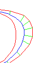
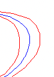

[](https://crates.io/crates/centerline)
[](https://docs.rs/centerline)
[](https://github.com/eadf/centerline.rs/workflows/Rust/badge.svg)
[](https://github.com/eadf/centerline.rs/workflows/Clippy/badge.svg)
[](https://deps.rs/crate/centerline/0.1.0)

# Centerline


Finds centerlines of closed 2D geometries. It is focused on letter like shapes, i.e. vertex loops with potential enclosed islands of loops.
Loops directly connected to other loops does not work at the moment. 

It uses a [segmented voronoi diagram](https://crates.io/crates/boostvoronoi) as a base, then it filters out the 
'spiky' bits (green) by comparing the angle between the edge (green), and the input geometry (red) that created it.
If the angle is close to 90°, it will be ignored. Note that the result (blue) technically is not a true centerline after the spikes has been filtered out, but it 
makes for much cleaner tool-paths etc. It also performs a line simplification on the resulting center-line. 

 

```rust
let segments = ...same as boost voronoi segments...
let mut centerline = Centerline::<i32, f32, i64, f64>::with_segments(segments);
centerline.build_voronoi()?;
let normalized_dot_product_limit:f32 = 0.38;
let centerline_simplification:f32 = 0.1;

let _= centerline.calculate_centerline(normalized_dot_product_limit, centerline_simplification)?;
println!(
   "Result: lines:{}, line_strings:{}",
   centerline.lines.as_ref().map_or(0,|x|x.len()),
   centerline.line_strings.as_ref().map_or(0,|x|x.len())
);
```

## Gui example

```fish
cargo +nightly run --example fltk_gui
```
The example only displays 2D, but the generated center-line is actually 3D line segments.\
The Z coordinate is the distance between the 2D center-line, and the geometry that created it. 

The example GUI takes `.obj` files as input. The `.obj` file needs to be 2D in some axis aligned plane (one of the coordinates needs to be zero). 
Also make sure there are no intersecting outer edges.

## Rust requirement

Requires `#![feature(hash_drain_filter)]` and `#![feature(map_first_last)]` i.e. `rust +nightly`

## Todo

- [x] Shapes w/o a lead-in edge will not be drawn 
- [x] Group related shapes together based on convex hull and not just AABB
- [x] Rayon over each shape group
- [x] Open file dialogue for fltk_gui
- [x] Maybe, maybe make it possible to save result from fltk_gui :)
- [x] Make an option to remove inner center-lines of inner shapes. I.e. the holes in letters.
- [ ] Add opengl to fltk_gui so that the 3D aspect of the center-line can be visualized. 
